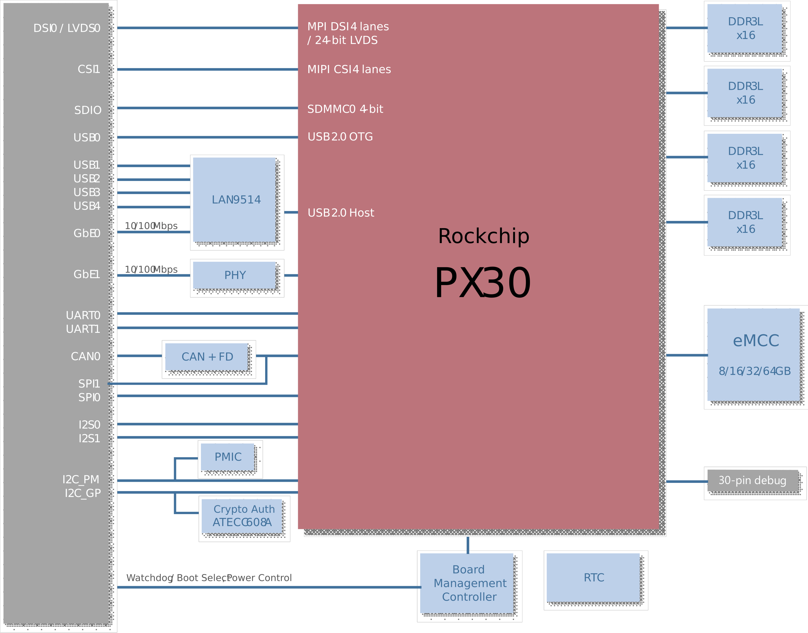
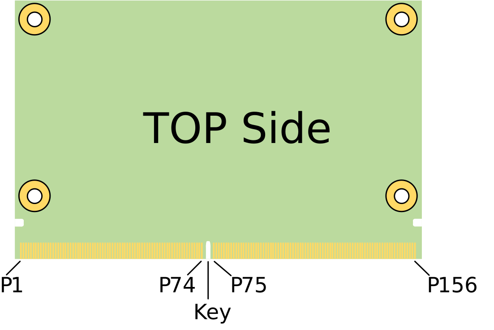
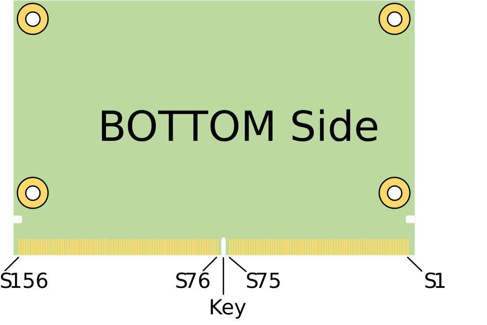
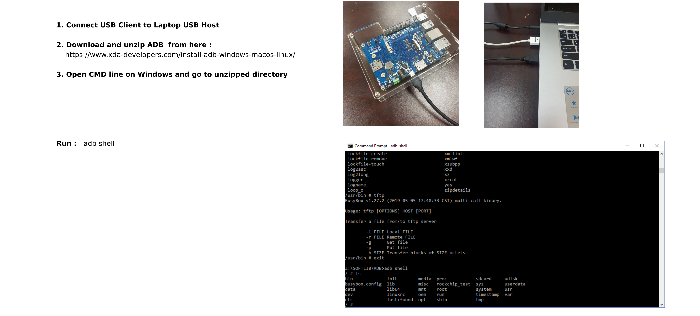

.. _intro:

Product Introduction
=====================

**Warning**: this is an EA (early available) engineering manual, meaning contents might properly reflect the actual or final version of this product

.. _section-1:

The SMARC Formfactor
--------------------

The SMARC (“Smart Mobility ARChitecture”) is a versatile small form
factor computer on Module definition targeting applications that require
low power, low costs, and high performance. The Modules will typically
use ARM SOCs similar or the same as those used in many familiar devices
such as tablet computers and smart phones. Alternative low power SOCs
and CPUs, such as tablet oriented X86 devices and other RISC CPUs may be
used as well. The Module power envelope is typically under 6W.

Two Module sizes are defined: 82 mm x 50 mm and 82 mm x 80 mm.

The Module PCBs have 314 edge fingers that mate with a low profile 314
pin 0.5 mm pitch right angle connector (the connector is sometimes
identified as a 321 pin connector, but 7 pins are lost to the key).

The Modules are used as building blocks for portable and stationary
embedded systems. The core CPU and support circuits, including DRAM,
boot flash, power sequencing, CPU power supplies, GBE and a single
channel LVDS display transmitter are concentrated on the Module. The
Modules are used with application specific Carrier Boards that implement
other features such as audio CODECs, touch controllers, wireless
devices, etc. The modular approach allows scalability, fast time to
market and upgradability while still maintaining low costs, low power
and small physical size.

.. image:: ../images/sget-logo.png 
 
SMARC module and carrier specifications are available online at :
https://www.sget.org/standards/smarc.html

Specifications
==============

Core System
-----------

**SoC**

Rockchip PX30 with Quad-core ARM Cortex-A35 CPU TrustZone technology
support ARMv8 Cryptography Extensions”

**Memory**

1GB or 2GB DDR3L at 1066/1333 MHz, memory down (non ECC)

**L2 Cache**

256KB unified system L2 cache

**IoT security**

CryptoAuthentication™ Device, Microchip ATECC608A

Cryptographic co-processor with secure hardware-based key storage for
sign-verify authentication provides Internet of Things (IoT) Protected

Storage for up to 16 keys, certificates or data ECDH: FIPS SP800-56A
Elliptic Curve Diffie-Hellman NIST standard P256

elliptic curve support SHA-256 & HMAC hash including off-chip context
save/restore AES-128: encrypt/decrypt, galois field multiply for GCM”

Video
-----

LEC-PX30 standard display support is limited to either 4-lane MIPI DSI
or single channel 24-bit LVDS. DSI and LVDS are multiplexed and either
of them can simply be enabled at boot time. HDMI panel support up to
1920x1080 resolution can be achieved by using a simple bridge on the
carrier. A reference design based on ADV7335 “MIPI/DSI Receiver with
HDMI Transmitter” is available

**GPU Core:**

Mali-G31

**GPU Feature Support**

Supports DirectX 11 FL9_3, OpenGLES 1.1/ 2.0 / 3.2, Vulkan 1.0, OpenCL
2.0

Full Profile Video decoding: H.264 up to 1080p@60fps, H.265/HEVC up to
1080p@60fps

MPEG-4, ISO/IEC 14496-2, SP@L0-3, ASP@L0-5, up to 1080p@60fps VP8, up to
1080p@60fps

Video Encoding: H.264 video encoder at BP/MP/HP@level 4.2
1920x1080@30fps, 1x 1080p@30fps or 2x 720p@30fps encoding

**MIPI DSI**

MIPI DSI 4 lanes at max. 1080p@60fps display output (default,
multiplexed with LVDS signal)

**LVDS**

LVDS single channel 24-bit at max. 1280x800@60fps (multiplexed with MIPI
DSI signal)

**Camera**

MIPI CSI RX Interface

- Compatible with the MIPI Alliance Interface specification v1.0

- Up to 4 data lanes, 1.0Gbps maximum data rate per lane, supporting MIPI-HS, MIPI-LP mode

Audio
-----

Supports ES8316 codec for high performance and low power multi-bit
deltasigma

audio ADC and DAC (located on carrier)

Dual Ethernet
-------------

**Primary LAN**

MAC 10/100 Ethernet Controller on SoC

Supports 10/100-Mbps data transfer rates, both full-duplex and
half-duplex

**Secondary LAN**

MAC/PHY 10/100 Ethernet Controller on LAN9514 via USB 2.0

Supports 10/100-Mbps data transfer rates, both full-duplex and
half-duplex

Extension busses
----------------

**USB**

4x USB 2.0, 1x USB OTG

**UART**

Two UART interfaces SER0 and SER2 (TX/X/CTS/RTS), 64-byte FIFO and support for 5-bit, 6-bit, 7-bit, 8-bit data transmit or receive

**CAN bus**

Supports CAN2.0B only or mixed CAN2.0B and CAN FD mode, data bit rate up
to 8 Mbps

**SPI**

2x SPI (one occupied by SPI-to-CAN controller )

**I2S**

2x I2S interfaces with audio resolution from 16-bits to 32-bits and
sample rate up to 192KHz (see Audio Codec support)

**I2C**

Four I2C interfaces

- Support for 7-bit and 10-bit address mode

- Software programmable clock frequency of 100 kbit/s in Standard-mode,

400 kbit/s in the Fast-mode or 1 Mbit/s in Fast-mode Plus

**GPIO**

12x GPIO with interrupt, one GPIO with PWM

System Storage
--------------

**SDIO**

1x SDIO (4-bit) compatible with SD3.0, MMC ver. 4.51

**eMMC**

8, 16, 32 or 64 GB (build option)

Compatible with eMMC specification 4.41, 4.51, 5.0 and 5.1

SEMA® Board Management Controller
---------------------------------

Voltage/current monitoring, boot configuration, logistics and forensic

information, flat panel control, watchdog timer

Debug Header
------------

30-pin multipurpose flat cable connector for use with optional DB-30
debug module Provides JTAG, BMC access; UART, power test points;
diagnostic LEDs, Power, Reset, Boot configuration

Power
-----

**Supply Voltage**

4.75 V – 5.25 V

**Rise Time**

Mechanical and Environmental
----------------------------

**Form Factor**

SGET SMARC Specifications v2.1 (2.1 is currently under approval by SGET)

**Dimension**

SMARC short size module, 82mm x 50mm

**Operating Temperature**

Standard: 0°C to +60°C

Rugged: -20°C to +85°C (optional)

**Humidity**

5-90% RH operating, non-condensing

5-95% RH storage (and operating with conformal coating)

**Shock and Vibration**

IEC 60068-2-64 and IEC-60068-2-27, MIL-STD-202 F, Method 213B, Table
213-I,

Condition A and Method 214A, Table 214-I, Condition D

Block Diagram
=============

Pinout and Signal Descriptions
==============================

The below table is a comprehensible list of all signal pins on the MXM 3
connector in the standard specification SMARC 2.1. Those signals not
supported on LEC-PX30 are strikethrough

Figure 1 – Module top/botom side pin numbering

===== ==================================== = ===== =============================================
P-Pin Primary (Top) Side                     S-Pin Secondary (Bottom) Side
===== ==================================== = ===== =============================================
\                                                 
                                             S1    [STRIKEOUT:CSI1_TX+ /] I2C_CAM1_CK
P1    [STRIKEOUT:SMB_ALERT_1V8#]             S2    [STRIKEOUT:CSI1_TX- /] I2C_CAM1_DAT
P2    GND                                    S3    GND
P3    CSI1_CK+                               S4    RSVD
P4    CSI1_CK-                               S5    [STRIKEOUT:CSI0_TX- / I2C_CAM0_CK]
P5    [STRIKEOUT:GBE1_SDP]                   S6    CAM_MCK
P6    [STRIKEOUT:GBE0_SDP]                   S7    [STRIKEOUT:CSI0_TX+ / I2C_CAM0_DAT]
P7    CSI1_RX0+                              S8    [STRIKEOUT:CSI0_CK+]
P8    CSI1_RX0-                              S9    [STRIKEOUT:CSI0_CK-]
P9    GND                                    S10   GND
P10   CSI1_RX1+                              S11   [STRIKEOUT:CSI0_RX0+]
P11   CSI1_RX1-                              S12   [STRIKEOUT:CSI0_RX0-]
P12   GND                                    S13   GND
P13   CSI1_RX2+                              S14   [STRIKEOUT:CSI0_RX1+]
P14   CSI1_RX2-                              S15   [STRIKEOUT:CSI0_RX1-]
P15   GND                                    S16   GND
P16   CSI1_RX3+                              S17   GBE1_MDI0+
P17   CSI1_RX3-                              S18   GBE1_MDI0-
P18   GND                                    S19   GBE1_LINK100#
P19   [STRIKEOUT:GBE0_MDI3-]                 S20   GBE1_MDI1+
P20   [STRIKEOUT:GBE0_MDI3+]                 S21   GBE1_MDI1-
P21   GBE0_LINK100#                          S22   [STRIKEOUT:GBE1_LINK1000#]
P22   [STRIKEOUT:GBE0_LINK1000#]             S23   [STRIKEOUT:GBE1_MDI2+]
P23   [STRIKEOUT:GBE0_MDI2-]                 S24   [STRIKEOUT:GBE1_MDI2-]
P24   [STRIKEOUT:GBE0_MDI2+]                 S25   GND
P25   GBE0_LINK_ACT#                         S26   [STRIKEOUT:GBE1_MDI3+]
P26   GBE0_MDI1-                             S27   [STRIKEOUT:GBE1_MDI3-]
P27   GBE0_MDI1+                             S28   GBE1_CTREF
P28   GBE0_CTREF                             S29   [STRIKEOUT:PCIE_D_TX+ / SERDES_1_TX+]
P29   GBE0_MDI0-                             S30   [STRIKEOUT:PCIE_D_TX- / SERDES_1_TX-]
P30   GBE0_MDI0+                             S31   GBE1_LINK_ACT#
P31   [STRIKEOUT:SPI0_CS1#]                  S32   [STRIKEOUT:PCIE_D_RX+ / SERDES_1_RX+]
P32   GND                                    S33   [STRIKEOUT:PCIE_D_RX- / SERDES_1_RX-]
P33   SDIO_WP                                S34   GND
P34   SDIO_CMD                               S35   USB4+
P35   SDIO_CD#                               S36   USB4-
P36   SDIO_CK                                S37   [STRIKEOUT:USB3_VBUS_DET]
P37   SDIO_PWR_EN                            S38   AUDIO_MCK
P38   GND                                    S39   I2S0_LRCK
P39   SDIO_D0                                S40   I2S0_SDOUT
P40   SDIO_D1                                S41   I2S0_SDIN
P41   SDIO_D2                                S42   I2S0_CK
P42   SDIO_D3                                S43   [STRIKEOUT:ESPI_ALERT0#]
P43   SPI0_CS0#                              S44   [STRIKEOUT:ESPI_ALERT1#]
P44   SPI0_CK                                S45   MDIO_CLK
P45   SPI0_DIN                               S46   MDIO_DAT
P46   SPI0_DO                                S47   GND
P47   GND                                    S48   I2C_GP_CK
P48   [STRIKEOUT:SATA_TX+]                   S49   I2C_GP_DAT
P49   [STRIKEOUT:SATA_TX-]                   S50   [STRIKEOUT:HDA_SYNC /] I2S2_LRCK
P50   GND                                    S51   [STRIKEOUT:HDA_SDO /] I2S2_SDOUT
P51   [STRIKEOUT:SATA_RX+]                   S52   [STRIKEOUT:HDA_SDI /] I2S2_SDIN
P52   [STRIKEOUT:SATA_RX-]                   S53   [STRIKEOUT:HDA_CK /] I2S2_CK
P53   GND                                    S54   [STRIKEOUT:SATA_ACT#]
P54   [STRIKEOUT:ESPI_CS0# /] SPI1_CS0#      S55   [STRIKEOUT:USB5_EN_OC#]
P55   [STRIKEOUT:ESPI_CS1# /] SPI1_CS1#      S56   [STRIKEOUT:ESPI_IO_2]
P56   [STRIKEOUT:ESPI_CK /] SPI1_CK          S57   [STRIKEOUT:ESPI_IO_3]
P57   [STRIKEOUT:ESPI_IO_1 /] SPI1_DIN       S58   [STRIKEOUT:ESPI_RESET#]
P58   [STRIKEOUT:ESPI_IO_0 /] **SPI1_DO**    S59   [STRIKEOUT:USB5+]
P59   GND                                    S60   [STRIKEOUT:USB5-]
P60   USB0+                                  S61   GND
P61   USB0-                                  S62   [STRIKEOUT:USB3_SSTX+]
P62   [STRIKEOUT:USB0_EN_OC#]                S63   [STRIKEOUT:USB3_SSTX-]
P63   USB0_VBUS_DET                          S64   GND
P64   USB0_OTG_ID                            S65   [STRIKEOUT:USB3_SSRX+]
P65   USB1+                                  S66   [STRIKEOUT:USB3_SSRX-]
P66   USB1-                                  S67   GND
P67   USB1_EN_OC#                            S68   USB3+
P68   GND                                    S69   USB3-
P69   USB2+                                  S70   GND
P70   USB2-                                  S71   [STRIKEOUT:USB2_SSTX+]
P71   USB2_EN_OC#                            S72   [STRIKEOUT:USB2_SSTX-]
P72   RSVD                                   S73   GND
P73   RSVD                                   S74   [STRIKEOUT:USB2_SSRX+]
P74   USB3_EN_OC#                            S75   [STRIKEOUT:USB2_SSRX-]
                                                    
      Key                                          Key
                                                    
P75   [STRIKEOUT:PCIE_A_RST#]                S76   [STRIKEOUT:PCIE_B_RST#]
P76   USB4_EN_OC#                            S77   [STRIKEOUT:PCIE_C_RST#]
P77   [STRIKEOUT:PCIE_B_CKREQ#]              S78   [STRIKEOUT:PCIE_C_RX+ / SERDES_2_RX+]
P78   [STRIKEOUT:PCIE_A_CKREQ#]              S79   [STRIKEOUT:PCIE_C_RX- / SERDES_2_RX-]
P79   GND                                    S80   GND
P80   [STRIKEOUT:PCIE_C_REFCK+]              S81   [STRIKEOUT:PCIE_C_TX+ / SERDES_2_TX+]
P81   [STRIKEOUT:PCIE_C_REFCK-]              S82   [STRIKEOUT:PCIE_C_TX- / SERDES_2_TX-]
P82   GND                                    S83   GND
P83   [STRIKEOUT:PCIE_A_REFCK+]              S84   [STRIKEOUT:PCIE_B_REFCK+]
P84   [STRIKEOUT:PCIE_A_REFCK-]              S85   [STRIKEOUT:PCIE_B_REFCK-]
P85   GND                                    S86   GND
P86   [STRIKEOUT:PCIE_A_RX+]                 S87   [STRIKEOUT:PCIE_B_RX+]
P87   [STRIKEOUT:PCIE_A_RX-]                 S88   [STRIKEOUT:PCIE_B_RX-]
P88   GND                                    S89   GND
P89   [STRIKEOUT:PCIE_A_TX+]                 S90   [STRIKEOUT:PCIE_B_TX+]
P90   [STRIKEOUT:PCIE_A_TX-]                 S91   [STRIKEOUT:PCIE_B_TX-]
P91   GND                                    S92   GND
P92   [STRIKEOUT:HDMI_D2+ / DP1_LANE0+]      S93   [STRIKEOUT:DP0_LANE0+]
P93   [STRIKEOUT:HDMI_D2- / DP1_LANE0-]      S94   [STRIKEOUT:DP0_LANE0-]
P94   GND                                    S95   [STRIKEOUT:DP0_AUX_SEL]
P95   [STRIKEOUT:HDMI_D1+ / DP1_LANE1+]      S96   [STRIKEOUT:DP0_LANE1+]
P96   [STRIKEOUT:HDMI_D1- / DP1_LANE1-]      S97   [STRIKEOUT:DP0_LANE1-]
P97   GND                                    S98   [STRIKEOUT:DP0_HPD]
P98   [STRIKEOUT:HDMI_D0+ / DP1_LANE2+]      S99   [STRIKEOUT:DP0_LANE2+]
P99   [STRIKEOUT:HDMI_D0- / DP1_LANE2-]      S100  [STRIKEOUT:DP0_LANE2-]
P100  GND                                    S101  GND
P101  [STRIKEOUT:HDMI_CK+ / DP1_LANE3+]      S102  [STRIKEOUT:DP0_LANE3+]
P102  [STRIKEOUT:HDMI_CK- / DP1_LANE3-]      S103  [STRIKEOUT:DP0_LANE3-]
P103  GND                                    S104  [STRIKEOUT:USB3_OTG_ID]
P104  [STRIKEOUT:HDMI_HPD / DP1_HPD]         S105  [STRIKEOUT:DP0_AUX+]
P105  [STRIKEOUT:HDMI_CTRL_CK / DP1_AUX+]    S106  [STRIKEOUT:DP0_AUX-]
P106  [STRIKEOUT:HDMI_CTRL_DAT / DP1_AUX-]   S107  [STRIKEOUT:LCD1_BKLT_EN]
P107  [STRIKEOUT:DP1_AUX_SEL]                S108  [STRIKEOUT:LVDS1_CK+ / eDP1_AUX+ / DSI1_CLK+]
P108  GPIO0 [STRIKEOUT:/ CAM0_PWR#]          S109  [STRIKEOUT:LVDS1_CK- / eDP1_AUX- / DSI1_CLK-]
P109  GPIO1 / CAM1_PWR#                      S110  GND
P110  GPIO2 [STRIKEOUT:/ CAM0_RST#]          S111  [STRIKEOUT:LVDS1_0+ / eDP1_TX0+ / DSI1_D0+]
P111  GPIO3 / CAM1_RST#                      S112  [STRIKEOUT:LVDS1_0- / eDP1_TX0- / DSI1_D0-]
P112  GPIO4 [STRIKEOUT:/ HDA_RST#]           S113  [STRIKEOUT:eDP1_HPD / DSI1_TE]
P113  GPIO5 / PWM_OUT                        S114  [STRIKEOUT:LVDS1_1+ / eDP1_TX1+ / DSI1_D1+]
P114  GPIO6 [STRIKEOUT:/ TACHIN]             S115  [STRIKEOUT:LVDS1_1- / eDP1_TX1- / DSI1_D1-]
P115  GPIO7                                  S116  [STRIKEOUT:LCD1_VDD_EN]
P116  GPIO8                                  S117  [STRIKEOUT:LVDS1_2+ / eDP1_TX2+ / DSI1_D2+]
P117  GPIO9                                  S118  [STRIKEOUT:LVDS1_2- / eDP1_TX2- / DSI1_D2-]
P118  GPIO10                                 S119  GND
P119  GPIO11                                 S120  [STRIKEOUT:LVDS1_3+ / eDP1_TX3+ / DSI1_D3+]
P120  GND                                    S121  [STRIKEOUT:LVDS1_3- / eDP1_TX3- / DSI1_D3-]
P121  I2C_PM_CK                              S122  [STRIKEOUT:LCD1_BKLT_PWM]
P122  I2C_PM_DAT                             S123  GPIO13
P123  BOOT_SEL0#                             S124  GND
P124  BOOT_SEL1#                             S125  LVDS0_0+ / [STRIKEOUT:eDP0_TX0+] / DSI0_D0+
P125  BOOT_SEL2#                             S126  LVDS0_0- / [STRIKEOUT:eDP0_TX0-] / DSI0_D0-
P126  RESET_OUT#                             S127  LCD0_BKLT_EN
P127  RESET_IN#                              S128  LVDS0_1+ / [STRIKEOUT:eDP0_TX1+] / DSI0_D1+
P128  POWER_BTN#                             S129  LVDS0_1- / [STRIKEOUT:eDP0_TX1-] / DSI0_D1-
P129  SER0_TX                                S130  GND
P130  SER0_RX                                S131  LVDS0_2+/\ [STRIKEOUT:eDP0_TX2+]/ DSI0_D2+
P131  SER0_RTS#                              S132  LVDS0_2- / [STRIKEOUT:eDP0_TX2-] / DSI0_D2-
P132  SER0_CTS#                              S133  LCD0_VDD_EN
P133  GND                                    S134  LVDS0_CK+/\ [STRIKEOUT:eDP0_AUX]/ DSI0_CLK+
P134  [STRIKEOUT:SER1_TX]                    S135  LVDS0_CK-/\ [STRIKEOUT:eDP0_AUX-]/ DSI0_CLK-
P135  [STRIKEOUT:SER1_RX]                    S136  GND
P136  SER2_TX                                S137  LVDS0_3+ / [STRIKEOUT:eDP0_TX3+] / DSI0_D3+
P137  SER2_RX                                S138  LVDS0_3- / [STRIKEOUT:eDP0_TX3-] / DSI0_D3-
P138  SER2_RTS#                              S139  I2C_LCD_CK
P139  SER2_CTS#                              S140  I2C_LCD_DAT
P140  [STRIKEOUT:SER3_TX]                    S141  LCD0_BKLT_PWM
P141  [STRIKEOUT:SER3_RX]                    S142  GPIO12
P142  GND                                    S143  GND
P143  CAN0_TX                                S144  [STRIKEOUT:eDP0_HPD /] DSI0_TE
P144  CAN0_RX                                S145  WDT_TIME_OUT#
P145  [STRIKEOUT:CAN1_TX]                    S146  [STRIKEOUT:PCIE_WAKE#]
P146  [STRIKEOUT:CAN1_RX]                    S147  VDD_RTC
P147  VDD_IN                                 S148  LID#
P148  VDD_IN                                 S149  SLEEP#
P149  VDD_IN                                 S150  VIN_PWR_BAD#
P150  VDD_IN                                 S151  [STRIKEOUT:CHARGING#]
P151  VDD_IN                                 S152  [STRIKEOUT:CHARGER_PRSNT#]
P152  VDD_IN                                 S153  CARRIER_STBY#
P153  VDD_IN                                 S154  CARRIER_PWR_ON
P154  VDD_IN                                 S155  FORCE_RECOV#
P155  VDD_IN                                 S156  BATLOW#
P156  VDD_IN                                 S157  TEST#
\                                            S158  GND
===== ==================================== = ===== =============================================

**Note**: [STRIKEOUT:STRIKETHROUGH] strike-through entries are not supported functions on this product

|br|

Signal Terminology Descriptions
-------------------------------

Meaning of the terms used for signal description tables

=========== =================================================================================================================
**Term**    **Description**
=========== =================================================================================================================
\          
I           Input to the module
O           Output from the module
O OD        Open drain output from the module
I OD        Open drain input to the module, with mandatory PU (pull up) on module
OD          Open drain
I/O         Bi-directional Input/Output
PU          PU (pull-up) resistor on module
PD          PD (pull-down) resistor on module
VDD_IN      Main power source  from carrier to module
CMOS        Logic input or output
GBE MDI     Differential analog signaling for Gigabit Media Dependent Interface
LVDS DP     Low Voltage Differential Signal for DisplayPort interface
LVDS D-PHY  Low Voltage Differential Signal for MIPI CSI-2 cameras and DSI displays
LVDS M-PHY  Low Voltage Differential Signal for MIPI CSI-3 cameras
LVDS LCD    Low Voltage Differential Signal for LCD displays
LVDS PCIE   Low Voltage Differential Signal for PCIe
LVDS SATA   Low Voltage Differential Signal for SATA
TMDS HDMI   Transition Minimized Differential Signal for HDMI displays
USB         DC coupled differential signaling for traditional (non-Superspeed) USB signals
USB SS      Differential signal for SuperSpeed USB signals
USB VBUS 5V 5V tolerant input for USB VBUS detection
3.3V        3.3V Power Domain: Active while CARRIER_PWRON is high and CARRIER_SBY# is NOT active (i.e. both signals are high)
1.8V        1.8V Power Domain: Active while CARRIER_PWRON is high and CARRIER_SBY# is NOT active (i.e. both signals are high)
3.3Vsb      3.3V Power Domain: Active while CARRIER_PWRON is high (regardless of CARRIER_SBY#)
1.8Vsb      1.8V Power Domain: Active while CARRIER_PWRON is high (regardless of CARRIER_SBY#)
=========== =================================================================================================================

|br|

The First Display Interface
~~~~~~~~~~~~~~~~~~~~~~~~~~~

This is a group of 30-pins that is split into a channel 0 and channel 1
and can support either dual channel LVDS ports, 2 separate single
channel LVDS ports, 2 MIPI DSI ports of 4 lanes each or 2 eDP ports 4
lanes each. A mix of different display type such as DSI and eDP is also
permitted.

========= ============= ================= ========================= ========= ========================= ========================= =========================
**Pin #** **LVDS Name** **MIPI DSI Name** **eDP Name**               **Pin #** **LVDS Name**             **MIPI DSI Name**         **eDP Name**
========= ============= ================= ========================= ========= ========================= ========================= =========================                                                                                                                           
S125      LVDS0_0+      DSI0_D0+          [STRIKEOUT:eDP0_TX0+       S111      [STRIKEOUT:LVDS1_0+       [STRIKEOUT:DSI1_D0+       [STRIKEOUT:eDP1_TX0+
S126      LVDS0_0-      DSI0_D0-          eDP0_TX0-                  S112      LVDS1_0-                  DSI1_D0-                  eDP1_TX0-
S128      LVDS0_1+      DSI0_D1+          eDP0_TX1+                  S114      LVDS1_1+                  DSI1_D1+                  eDP1_TX1+
S129      LVDS0_1 -     DSI0_D1-          eDP0_TX1-                  S115      LVDS1_1 -                 DSI1_D1-                  eDP1_TX1-
S131      LVDS0_2+      DSI0_D2+          eDP0_TX2+                  S117      LVDS1_2+                  DSI1_D2+                  eDP1_TX2+
S132      LVDS0_2-      DSI0_D2-          eDP0_TX2-                  S118      LVDS1_2-                  DSI1_D2-                  eDP1_TX2-
S137      LVDS0_3+      DSI0_D3+          eDP0_TX3+                  S120      LVDS1_3+                  DSI1_D3+                  eDP1_TX3+
S138      LVDS0_3-      DSI0_D3-          eDP0_TX3-]                 S121      LVDS1_3-]                 DSI1_D3-]                 eDP1_TX3-]
S134      LVDS0_CK+     DSI0_CLK+         [STRIKEOUT:eDP0_AUX+       S108      [STRIKEOUT:LVDS1_CK+      [STRIKEOUT:DSI1_CLK+      [STRIKEOUT:eDP1_AUX+
S135      LVDS0_CK-     DSI0_CLK-         eDP0_AUX-]                 S109      LVDS1_CK-]                DSI1_CLK-]                eDP1_AUX-]
S133      LCD0_VDD_EN   LCD0_VDD_EN       [STRIKEOUT:LCD0_VDD_EN]    S116      [STRIKEOUT:LCD1_VDD_EN]   [STRIKEOUT:LCD1_VDD_EN]   [STRIKEOUT:LCD1_VDD_EN]
S127      LCD0_BKLT_EN  LCD0_BKLT_EN      [STRIKEOUT:LCD0_BKLT_EN]   S107      [STRIKEOUT:LCD1_BKLT_EN]  [STRIKEOUT:LCD1_BKLT_EN]  [STRIKEOUT:LCD1_BKLT_EN]
S141      LCD0_BKLT_PWM LCD0_BKLT_PWM     [STRIKEOUT:LCD0_BKLT_PWM]  S122      [STRIKEOUT:LCD1_BKLT_PWM] [STRIKEOUT:LCD1_BKLT_PWM] [STRIKEOUT:LCD1_BKLT_PWM]
S144                    DSI0_TE           [STRIKEOUT:eDP0_HPD]       S113                                [STRIKEOUT:DSI1_TE]       [STRIKEOUT:eDP1_HPD]                                                                                                                          
S139      I2C_LCD_CK    I2C_LCD_CK        [STRIKEOUT:I2C_LCD_CK]                                                                  
S140      I2C_LCD_DAT   I2C_LCD_DAT       [STRIKEOUT:I2C_LCD_DAT]                                                                 
========= ============= ================= ========================= ========= ========================= ========================= =========================

Configuration and actual display ports supported greatly depends on the
capabilities and internal multiplexing of the silicon used in this
desing.

Subsequent tables for LVDS, DSI and eDP describe signals that are
supported on this product. Unsupported signals are crossed out
([STRIKEOUT:STRIKETHROUGH]) or in case multiplexed (either or) this will
be described in NOTES.

|br|

**Note**: DSI0 mode or LVDS0 can be selected at boot time through DVT (device tree), DSI0 is default

|br| 

LVDS0 mode
^^^^^^^^^^

============= ========= ============================================================================ ============ ============= ======== =========== ============
**Name**      **Pin #** **Description**                                                              **I/O Type** **I/O Level** **Power  **PU / PD** **Comments**
                                                                                                                                Domain**            
============= ========= ============================================================================ ============ ============= ======== =========== ============                                                                                                                                                   
LVDS0_0+      S125      Primary LVDS channel differential pair data lines                            O LVDS                     Runtime               
LVDS0_0-      S126                                                                                   LCD                                            
LVDS0_1+      S128                                                                                                                                  
LVDS0_1 -     S129                                                                                                                                  
LVDS0_2+      S131                                                                                                                                  
LVDS0_2-      S132                                                                                                                                  
LVDS0_3+      S137                                                                                                                                  
LVDS0_3-      S138                                                                                                                                  
LVDS0_CK+     S134      Primary LVDS channel differential pair clock lines                           O LVDS                     Runtime               
LVDS0_CK-     S135                                                                                   LCD                                            
LCD0_VDD_EN   S133      Primary LVDS channel power enable, active high                               O            1.8V          Runtime               
                                                                                                     CMOS                                           
LCD0_BKLT_EN  S127      Primary LVDS channel backlight enable, active high                           O            1.8V          Runtime               
                                                                                                     CMOS                                           
LCD0_BKLT_PWM S141      Primary LVDS channel brightness control through pulse width modulation (PWM) O            1.8V          Runtime               
                                                                                                     CMOS                                                                                                                                                                                          
I2C_LCD_DAT   S140      DDC data line used for flat panel detection and control                      I/O OD       1.8V          Runtime  PU 2k2     
                                                                                                     CMOS                                           
I2C_LCD_CK    S139      DDC clock line used for flat panel detection and control                     O OD         1.8V          Runtime  PU 2k2     
                                                                                                     CMOS                                           
============= ========= ============================================================================ ============ ============= ======== =========== ============

DSI mode
^^^^^^^^

============= ========= ===================================================================== ====== ============= ================ =========== ============
**Name**      **Pin #** **Description**                                                       **I/O  **I/O Level** **Power Domain** **PU / PD** **Comments**
                                                                                              Type**                                           
============= ========= ===================================================================== ====== ============= ================ =========== ============                                                                                                                                     
DSI0_D0+      S125      Primary DSI panel differential pair data lines                        O LVDS               Runtime                       
DSI0_D0-      S126                                                                            D-PHY                                            
DSI0_D1+      S128                                                                                                                             
DSI0_D1-      S129                                                                                                                             
DSI0_D2+      S131                                                                                                                             
DSI0_D2-      S132                                                                                                                             
DSI0_D3+      S137                                                                                                                             
DSI0_D3-      S138                                                                                                                             
DSI0_CLK+     S134      Primary DSI panel differential pair clock lines.                      O LVDS               Runtime                       
DSI0_CLK-     S135                                                                            D-PHY                                            
LCD0_VDD_EN   S133      Primary panel power enable, active high                               O      1.8V          Runtime                       
                                                                                              CMOS                                             
LCD0_BKLT_EN  S127      Primary panel backlight enable, active high                           O      1.8V          Runtime                       
                                                                                              CMOS                                             
LCD0_BKLT_PWM S141      Primary panel brightness control through pulse width modulation (PWM) O      1.8V          Runtime                       
                                                                                              CMOS                                             
DSI0_TE       S144      Primary DSI panel tearing effect sigal                                I      1.8V          Runtime                       
                                                                                              CMOS                                                                                                                                                                                       
I2C_LCD_DAT   S140      DDC data line used for flat panel detection and control               I/O OD 1.8V          Runtime          PU 2k2     
                                                                                              CMOS                                             
I2C_LCD_CK    S139      DDC clock line used for flat panel detection and control              O OD   1.8V          Runtime          PU 2k2     
                                                                                              CMOS                                             
============= ========= ===================================================================== ====== ============= ================ =========== ============

Second / Third Display Interface
~~~~~~~~~~~~~~~~~~~~~~~~~~~~~~~~

All the below signals on Second Interface are not supported

========= ========================= =======================
**Pin #** **HDMI signal names**     **DP++ signal names**
========= ========================= =======================
\                          
P92       [STRIKEOUT:HDMI_D2+       [STRIKEOUT:DP1_LANE0+
P93       HDMI_D2-                  DP1_LANE0-
P95       HDMI_D1+                  DP1_LANE1+
P96       HDMI_D1-                  DP1_LANE1-
P98       HDMI_D0+                  DP1_LANE2+
P99       HDMI_D0-]                 DP1_LANE2-]
P101      [STRIKEOUT:HDMI_CK+       [STRIKEOUT:DP1_LANE3+
P102      HDMI_CK-]                 DP1_LANE3-]
S105      [STRIKEOUT:HDMI_CTRL_CK]  [STRIKEOUT:DP1_AUX+]
S106      [STRIKEOUT:HDMI_CTRL_DAT] [STRIKEOUT:DP1_AUX-]
P104      [STRIKEOUT:HDMI_HPD]      [STRIKEOUT:DP1_HPD]
\                                  
P107      [STRIKEOUT: ]             [STRIKEOUT:DP1_AUX_SEL]
========= ========================= =======================

All the below signals on Third Interface are not supported

========= =======================
**Pin #** **DP++ signal names**
========= =======================
\        
P92       [STRIKEOUT:DP0_LANE0+
P93       DP0_LANE0-
P95       DP0_LANE1+
P96       DP0_LANE1-
P98       DP0_LANE2+
P99       DP0_LANE2-]
P101      [STRIKEOUT:DP0_LANE3+
P102      DP0_LANE3-]
S105      [STRIKEOUT:DP0_AUX+]
S106      [STRIKEOUT:DP0_AUX-]
P104      [STRIKEOUT:DP0_HPD]
\        
P107      [STRIKEOUT:DP0_AUX_SEL]
========= =======================

.. _section-2:

**Note**: HDMI support up to 1920x1080 can be implemented through a DSI to HDMI on the carrier, there is a reference design based on Analog Devices’ ADV7533 MIPI/DSI Receiver with HDMI Transmitter

|br|

MIPI CSI1 (Camera)
~~~~~~~~~~~~~~~~~~

============== ========= ======================================================================= ============== ======= ======== =========== ======================================================
**Name**       **Pin #** **Description**                                                         **I/O          **I/O   **Power  **PU / PD** **Comments**
                                                                                                 Type**         Level** Domain**            
============== ========= ======================================================================= ============== ======= ======== =========== ======================================================
\                                                                                                                                           
CSI1_RX0+      P7        CSI1 differential input (point to point)                                I LVDS D-PHY           Runtime               
CSI1_RX0-      P8                                                                                / I LVDS M-PHY                             
CSI1_RX1+      P10                                                                                                                          
CSI1_RX1-      P11                                                                                                                          
CSI1_RX2+      P13                                                                                                                          
CSI1_RX2-      P14                                                                                                                          
CSI1_RX3+      P16                                                                                                                          
CSI1_RX3-      P17                                                                                                                          
CSI1_CK+       P3        CSI1 differential clock input (point to point)                          I LVDS D-PHY           Runtime               
CSI1_CK-       P4                                                                                                                           
I2C_CAM1_DAT / S2        I2C data for serial camera data support link or differential data lane  I/O OD CMOS    1.8V    Runtime  PU 2.2K     MIPI-CSI 2.0 mode uses I2C_CAM1_DAT
CSI1_TX-                                                                                         / O LVDS M-PHY                              MIPI-CSI 3.0 mode uses CSI1_TX-
I2C_CAM1_CK /  S1        I2C clock for serial camera data support link or differential data lane O OD CMOS      1.8V    Runtime  PU 2.2K     MIPI-CSI 2.0 mode uses I2C_CAM1_CK
CSI1_TX+                                                                                         / O LVDS M-PHY                              MIPI-CSI 3.0 mode uses CSI1_TX+
CAM1_PWR# /    P109      Camera 0 Power Enable, active low output.                               O CMOS         1.8V    Runtime              CAM1_PWR# is default, GPIO1 can be enabled through DVT
GPIO1                                                                                                                                       
CAM1_RST# /    P111      Camera 0 reset, active low output                                       O CMOS         1.8V    Runtime              CAM1_PWR# is default, GPIO3 can be enabled through DVT
GPIO3                                                                                                                                       
\                                                                                                                                           
CAM_MCK        S6        Master clock output                                                     O CMOS         1.8V    Runtime               
============== ========= ======================================================================= ============== ======= ======== =========== ======================================================

I2S (audio)
~~~~~~~~~~~

========== ========= ======================================= ====== ======= ======== =========== ========================================
**Name**   **Pin #** **Description**                         **I/O  **I/O   **Power  **PU / PD** **Comments**
                                                             Type** Level** Domain**            
========== ========= ======================================= ====== ======= ======== =========== ========================================
\                                                                                               
I2S0_LRCK  S39       I2S0 Left & Right synchronization clock I/O    1.8V    Runtime              Module Output if CPU acts in Master Mode
                                                             CMOS                                Module Input if CPU acts in Slave Mode
I2S0_SDOUT S40       I2S0 Digital audio Output               O      1.8V    Runtime               
                                                             CMOS                               
I2S0_SDIN  S41       I2S0 Digital audio Input                I      1.8V    Runtime               
                                                             CMOS                               
I2S0_CK    S42       I2S0 Digital audio clock                I/O    1.8V    Runtime              Module Output if CPU acts in Master Mode
                                                             CMOS                                Module Input if CPU acts in Slave Mode
\                                                                                               
I2S2_LRCK  S50       I2S2 Left & Right synchronization clock I/O    1.8V    Runtime              Module Output if CPU acts in Master Mode
                                                             CMOS                                Module Input if CPU acts in Slave Mode
I2S2_SDOUT S51       I2S2 Digital audio Output               O      1.8V    Runtime               
                                                             CMOS                               
I2S2_SDIN  S52       I2S2 Digital audio Input                I      1.8V    Runtime               
                                                             CMOS                               
I2S2_CK    S53       I2S2 Digital audio clock                I/O    1.8V    Runtime              Module Output if CPU acts in Master Mode
                                                             CMOS                                Module Input if CPU acts in Slave Mode
\                                                                                               
AUDIO_MCK  S38       Master clock output to I2S codec(s)     O      1.8V    Runtime               
                                                             CMOS                               
========== ========= ======================================= ====== ======= ======== =========== ========================================

**Note**: I2S1 signalling has been removed during update to SMARC 2.0 specification

|br|

USB ports
~~~~~~~~~

======================= ============== ======================================================================= ================= ======================== =================== ================== =====================================================================================================================================
**Name**                **Pin #**      **Description**                                                         **I/O             **I/O                    **Power             **PU / PD**        **Comments**
                                                                                                               Type**            Level**                  Domain**                              
======================= ============== ======================================================================= ================= ======================== =================== ================== =====================================================================================================================================
\                                                                                                                                                                                               
USB0+                   P60            USB differential data pairs for port 0                                  I/O               USB                      Standby                                 From SOC
USB0-                   P61                                                                                    USB                                                                              
[STRIKEOUT:USB0_EN_OC#] P62            [STRIKEOUT:USB over-current sense for port 0]                           [STRIKEOUT:I/O OD [STRIKEOUT:3.3Vsb / 3.3V [STRIKEOUT:Standby] [STRIKEOUT:PU 10k] [STRIKEOUT:Pulled low by Module OD driver to disable USB0 power. Pulled low by Carrier OD driver to indicate over-current situation.]
                                                                                                               CMOS]             ]                                                              
USB0_VBUS_DET           P63            USB port 0 host power detection,                                        I                 USB VBUS 5V              Standby                                Can be connected to a USB client port VBUS pin
                                       when this port is used as a device.                                     USB VBUS 5V                                                                      
USB0_OTG_ID             P64            Input pin to announce OTG device insertion on USB 2.0 port              I                 3.3Vsb / 3.3V            Standby                                 
                                                                                                               CMOS                                                                             
\                                                                                                                                                                                               
USB1+                   P65            USB differential data pairs for port 1                                  I/O               USB                      Standby                                From USB HUB, alternatively USB HUB can be removed, and USB 2.0 Host directly routed to SOC
USB1-                   P66                                                                                    USB                                                                              
USB1_EN_OC#             P67            USB over-current sense for port 1                                       I/O OD            3.3Vsb / 3.3V            Standby             PU 10k             Pulled low by Module OD driver to disable USB0 power. Pulled low by Carrier OD driver to indicate over-current situation.
                                                                                                               CMOS                                                                             
\                                                                                                                                                                                               
USB2+                   P69            USB differential data pairs for port 2                                  I/O               USB                      Standby                                 From USB HUB
USB2-                   P70                                                                                    USB                                                                              
[STRIKEOUT:USB2_SSRX+   [STRIKEOUT:S74 [STRIKEOUT:Receive signal differential pairs for SuperSpeed on port 2]  [STRIKEOUT:I      [STRIKEOUT:USB SS]       [STRIKEOUT:Standby] [STRIKEOUT: ]      USB 3.0 mode not supported
USB2_SSRX-]             S75]                                                                                   USB SS]                                                                          
[STRIKEOUT:USB2_SSTX+   [STRIKEOUT:S71 [STRIKEOUT:Transmit signal differential pairs for SuperSpeed on port 2] [STRIKEOUT:O      [STRIKEOUT:USB SS]       [STRIKEOUT:Standby] [STRIKEOUT: ]      USB 3.0 mode not supported
USB2_SSTX-]             S72]                                                                                   USB SS]                                                                          
USB2_EN_OC#             P71            USB over-current sense for port 2                                       I/O OD            3.3Vsb / 3.3V            Standby             PU 10k             Pulled low by Module OD driver to disable USB0 power. Pulled low by Carrier OD driver to indicate over-current situation.
                                                                                                               CMOS                                                                             
======================= ============== ======================================================================= ================= ======================== =================== ================== =====================================================================================================================================

========================= ============== ================================================================================ ============ ========================= =================== ====== =========================================================================================================================
USB3+                     S68            USB differential data pairs for port 3                                           I/O          USB                       Standby                     From USB HUB
USB3-                     S69                                                                                             USB                                                              
========================= ============== ================================================================================ ============ ========================= =================== ====== =========================================================================================================================
[STRIKEOUT:USB3_SSRX+     [STRIKEOUT:S65 [STRIKEOUT:Receive signal differential pairs for SuperSpeed on port 3]           [STRIKEOUT:I [STRIKEOUT:USB SS]        [STRIKEOUT:Standby]        USB 3.0 mode not supported
USB3_SSRX-]               S66]                                                                                            USB SS]                                                          
[STRIKEOUT:USB3_SSTX+     [STRIKEOUT:S62 [STRIKEOUT:Transmit signal differential pairs for SuperSpeed on port 3]          [STRIKEOUT:O [STRIKEOUT:USB SS]        [STRIKEOUT:Standby]        USB 3.0 mode not supported
USB3_SSTX-]               S63]                                                                                            USB SS]                                                          
USB3_EN_OC#               P74            USB over-current sense for port 3                                                I/O OD       3.3Vsb / 3.3V             Standby             PU 10k Pulled low by Module OD driver to disable USB0 power. Pulled low by Carrier OD driver to indicate over-current situation.
                                                                                                                          CMOS                                                             
[STRIKEOUT:USB3_VBUS_DET] S37            [STRIKEOUT:USB port 3 host power detection, when this port is used as a device.] [STRIKEOUT:I [STRIKEOUT:USB VBUS 5V]   [STRIKEOUT:Standby]         
                                                                                                                          USB VBUS 5V]                                                     
[STRIKEOUT:USB3_OTG_ID]   S104           [STRIKEOUT:Input pin to announce OTG device insertion on USB 3.0 port]           [STRIKEOUT:I [STRIKEOUT:3.3Vsb / 3.3V] [STRIKEOUT:Standby]         
                                                                                                                          CMOS]                                                            
\                                                                                                                                                                                          
USB4+                     S35            USB differential data pairs for port 4                                           I/O          USB                       Standby                     From USB HUB
USB4-                     S36                                                                                             USB                                                              
USB4_EN_OC#               P76            USB over-current sense for port 4                                                I/O OD       3.3Vsb / 3.3V             Standby             PU 10k Pulled low by Module OD driver to disable USB0 power. Pulled low by Carrier OD driver to indicate over-current situation.
                                                                                                                          CMOS                                                             
========================= ============== ================================================================================ ============ ========================= =================== ====== =========================================================================================================================

**Note**: USB 3 & 4 ports will only be active in final design

|br|

PCIe Ports
~~~~~~~~~~

This design does not support PCIe ports

SATA Ports
~~~~~~~~~~

This design does not support SATA ports

Dual LAN ports
~~~~~~~~~~~~~~

========================== ========= ======================================================================================================================================= ============= ================= =================== ============= ======================================================
**Name**                   **Pin #** **Description**                                                                                                                         **I/O         **I/O             **Power Domain**    **PU / PD**   **Comments**
                                                                                                                                                                             Type**        Level**                                            
========================== ========= ======================================================================================================================================= ============= ================= =================== ============= ======================================================
\                                                                                                                                                                                                                                             
GBE0_MDI0+                 P30       10/100 Mbps Ethernet Controller 0: Media Dependent Interface Differential Pairs 0, 1. The MDI can operate in 100, and 10Mbit/sec modes. GBE MDI                         Standby                           Twisted pair signals for external transformer.
GBE0_MDI0-                 P29       100 10 \_                                                                                                                                                                                                
GBE0_MDI1+                 P27       MDI[0]+/- TX+/- TX+/-                                                                                                                                                                                    
GBE0_MDI1-                 P26       MDI[1]+/- RX+/- RX+/-                                                                                                                                                                                    
[STRIKEOUT:GBE0_MDI2+      P24                                                                                                                                                                                                                
GBE0_MDI2-                 P23                                                                                                                                                                                                                
GBE0_MDI3+                 P20                                                                                                                                                                                                                
GBE0_MDI3-]                P19                                                                                                                                                                                                                
GBE0_LINK100#              P21       Link Speed Indication LED for GBE 0 100Mbps                                                                                             O OD CMOS     3.3V              Standby                           Shall be able to sink 24mA or more Carrier LED current
[STRIKEOUT:GBE0_LINK1000#] P22       [STRIKEOUT:Link Speed Indication LED for GBE 0 1000Mbps]                                                                                O OD          3.3V              Standby                           Shall be able to sink 24mA or more Carrier LED current
                                                                                                                                                                             CMOS                                                             
GBE0_LINK_ACT#             P25       Link / Activity Indication LED Driven low on Link (10, 100 mbps) Blinks on Activity                                                     O OD          3.3V              Standby                           Shall be able to sink 24mA or more Carrier LED current
                                                                                                                                                                             CMOS                                                             
GBE0_CTREF                 P28       Center-Tap reference voltage for Carrier board Ethernet magnetic (if required by the Module GBE PHY)                                    Analog        0 to              Standby                            
                                                                                                                                                                                           3.3V max                                           
[STRIKEOUT:GBE0_SDP]       P6        [STRIKEOUT:IEEE 1588 Trigger Signal. For hardware implementation of PTP (precision time protocol)]                                      [STRIKEOUT:IO [STRIKEOUT:3.3V ] [STRIKEOUT:Standby] [STRIKEOUT: ] [STRIKEOUT: ]
                                                                                                                                                                             CMOS]                                                            
\                                                                                                                                                                                                                                             
GBE1_MDI0+                 S17       10/100 Mbps Ethernet Controller 0: Media Dependent Interface Differential Pairs 0, 1. The MDI can operate in 100, and 10Mbit/sec modes. GBE MDI                         Standby                           Twisted pair signals for external transformer.
GBE1_MDI0-                 S18       100 10 \_                                                                                                                                                                                                
GBE1_MDI1+                 S20       MDI[0]+/- TX+/- TX+/-                                                                                                                                                                                    
GBE1_MDI1-                 S21       MDI[1]+/- RX+/- RX+/-                                                                                                                                                                                    
[STRIKEOUT:GBE1_MDI2+      S23                                                                                                                                                                                                                
GBE1_MDI2-                 S24                                                                                                                                                                                                                
GBE1_MDI3+                 S26                                                                                                                                                                                                                
GBE1_MDI3-]                S27                                                                                                                                                                                                                
GBE1_LINK100#              S19       Link Speed Indication LED for GBE 1 100Mbps                                                                                             O OD          3.3V              Standby                           Shall be able to sink 24mA or more Carrier LED current
                                                                                                                                                                             CMOS                                                             
[STRIKEOUT:GBE1_LINK1000#] S22       [STRIKEOUT:Link Speed Indication LED for GBE 1 1000Mbps]                                                                                O OD          3.3V              Standby                           Shall be able to sink 24mA or more Carrier LED current
                                                                                                                                                                             CMOS                                                             
GBE1_LINK_ACT#             S31       Link / Activity Indication LED Driven low on Link (10, 100 mbps) Blinks on Activity                                                     O OD          3.3V              Standby                           Shall be able to sink 24mA or more Carrier LED current
                                                                                                                                                                             CMOS                                                             
GBE1_CTREF                 S28       Center-Tap reference voltage for Carrier board Ethernet magnetic \`(if required by the Module GBE PHY)\`                                Analog        0 to 3.3V max     Standby                            
[STRIKEOUT:GBE1_SDP]       P5        [STRIKEOUT:IEEE 1588 Trigger Signal. For hardware implementation of PTP (precision time protocol)]                                      IO            3.3V              Standby                            
                                                                                                                                                                             CMOS                                                             
========================== ========= ======================================================================================================================================= ============= ================= =================== ============= ======================================================

SDIO (SDCard)
~~~~~~~~~~~~~

=========== ========= ============================================================================================================================================================================================================= ====== ======= ======== =========== ======================================================================================================================================
**Name**    **Pin #** **Description**                                                                                                                                                                                               **I/O  **I/O   **Power  **PU / PD** **Comments**
                                                                                                                                                                                                                                    Type** Level** Domain**            
=========== ========= ============================================================================================================================================================================================================= ====== ======= ======== =========== ======================================================================================================================================
\                                                                                                                                                                                                                                                                      
SDIO_D0     P39       SDIO Data lines. These signals operate in push-pull mode.                                                                                                                                                     I/O    1.8V or Runtime              SDIO controller will detect SD Cards voltage level (1.8V for UHS-I and 3.3V for standard) and adjust its I/O voltage level accordingly
SDIO_D1     P40                                                                                                                                                                                                                     CMOS   3.3V                        
SDIO_D2     P41                                                                                                                                                                                                                                                        
SDIO_D3     P42                                                                                                                                                                                                                                                        
SDIO_WP     P33       SDIO Write Protect. This signal denotes the state                                                                                                                                                             I OD   3.3V    Runtime  PU 10k      Pulled up on module
                      of the write-protect tab on SD cards.                                                                                                                                                                         CMOS                               
SDIO_CMD    P34       SDIO Command/Response. This signal is used for card initialization and for command transfers. During initialization mode this signal is open drain. During command transfer this signal is in push-pull mode. I/O    1.8V or Runtime              SDIO controller will detect SD Cards voltage level (1.8V for UHS-I and 3.3V for standard) and adjust its I/O voltage level accordingly
                                                                                                                                                                                                                                    CMOS   3.3V                        
SDIO_CD#    P35       SDIO Card Detect.                                                                                                                                                                                             I OD   3.3V    Runtime  PU 10k      Pulled up on module
                      This signal indicates when a SDIO/MMC card is present.                                                                                                                                                        CMOS                               
SDIO_CK     P36       SDIO Clock. With each cycle of this signal a one-bit transfer on the command and each data line occurs.                                                                                                       O      1.8V or Runtime               
                                                                                                                                                                                                                                    CMOS   3.3V                        
SDIO_PWR_EN P37       SDIO Power Enable. This signal is used to                                                                                                                                                                     O      3.3V    Runtime              should be driven low in STB Mode by the module
                      enable the power being supplied to a SD/MMC card device.                                                                                                                                                      CMOS                               
=========== ========= ============================================================================================================================================================================================================= ====== ======= ======== =========== ======================================================================================================================================

SPI busses
~~~~~~~~~~

===================== ========= ===================================== ============ ================ =================== =========== ===========================================================================================
**Name**              **Pin #** **Description**                       **I/O        **I/O            **Power             **PU / PD** **Comments**
                                                                      Type**       Level**          Domain**                       
===================== ========= ===================================== ============ ================ =================== =========== ===========================================================================================
\                                                                                                                                  
SPI0_CS0#             P43       SPI0 Master Chip Select 0             O            1.8V             Standby                         This signal can be used to select carrier SPI as boot device
                                                                      CMOS                                                         
[STRIKEOUT:SPI0_CS1#] P31       [STRIKEOUT:SPI0 Master Chip Select 1] [STRIKEOUT:O [STRIKEOUT:1.8V] [STRIKEOUT:Standby]              
                                                                      CMOS]                                                        
SPI0_CK               P44       SPI0 Clock                            O            1.8V             Standby                          
                                                                      CMOS                                                         
SPI0_DIN              P45       SPI0 Master input / Slave output      I            1.8V             Standby                         also referred to as MISO
                                                                      CMOS                                                         
SPI0_DO               P46       SPI0 Master output / Slave input      O            1.8V             Standby                         also referred to as MOSI
                                                                      CMOS                                                         
\                                                                                                                                  
SPI1_CS0#             P45       SPI1 Master Chip Select 0             O            1.8V             Standby                         This signal can be used to select carrier SPI as boot device. can also be used as ESPI_CS0#
                                                                      CMOS                                                         
SPI1_CS1#             P55       SPI1 Master Chip Select 1             O            1.8V             Standby                         can also be used as ESPI_CS1#
                                                                      CMOS                                                         
SPI1_CK               P56       SPI1 Clock                            O            1.8V             Standby                         can also be used as ESPI_CK
                                                                      CMOS                                                         
SPI1_DIN              P57       SPI1 Master input / Slave output      I            1.8V             Standby                         also referred to as MISO can also be used as ESPI_IO_1
                                                                      CMOS                                                         
SPI1_DO               P58       SPI1 Master output / Slave input      O            1.8V             Standby                         also referred to as MOSI can also be used as ESPI_IO_0
                                                                      CMOS                                                         
===================== ========= ===================================== ============ ================ =================== =========== ===========================================================================================

**Note**: SPI0 is free to use on the carrier but support only one device through CS0 |br| SPI1 supports a CAN bus controller on the module through CS0, that
   leaves CS1 free for a device on the carrier

GPIO
~~~~

=================== ========= =========================== ====== ============= ================ ====================== ========================================================================================
**Name**            **Pin #** **Description**             **I/O  **I/O Level** **Power Domain** **PU / PD**            **Comments**
                                                          Type**                                                      
=================== ========= =========================== ====== ============= ================ ====================== ========================================================================================
\                                                                                                                     
GPIO0               P108      General purpose I/O pin 0.  I/O    1.8V          Runtime          PU 470K on the Module.
                                                          CMOS                                                        
[STRIKEOUT:GPIO1 /] P109      General purpose I/O pin 1.  I/O    1.8V          Runtime          PU 470K on the Module  Default use is Camera 1 Power Enable - active low, alternative mode is GPIO1 through DTS
CAM1_PWR#                                                 CMOS                                                        
GPIO2               P110      General purpose I/O pin 2.  I/O    1.8V          Runtime          PU 470K on the Module 
                                                          CMOS                                                        
[STRIKEOUT:GPIO3 /] P111      General purpose I/O pin 3.  I/O    1.8V          Runtime          PU 470K on the Module  Default use is Camera 1 Reset - active low, alternative mode is GPIO3 through DTS
CAM1_RST#                                                 CMOS                                                        
GPIO4               P112      General purpose I/O pin 4.  I/O    1.8V          Runtime          PU 470K on the Module 
                                                          CMOS                                                        
GPIO5 /             P113      General purpose I/O pin 5.  I/O    1.8V          Runtime          PU 470K on the Module  Default is GPIO mode, alternate use is PWM output through DTS
PWM_OUT                                                   CMOS                                                        
GPIO6               P114      General purpose I/O pin 6.  I/O    1.8V          Runtime          PU 470K on the Module 
                                                          CMOS                                                        
GPIO7               P115      General purpose I/O pin 7.  I/O    1.8V          Runtime          PU 470K on the Module   
                                                          CMOS                                                        
GPIO8               P116      General purpose I/O pin 8.  I/O    1.8V          Runtime          PU 470K on the Module   
                                                          CMOS                                                        
GPIO9               P117      General purpose I/O pin 9.  I/O    1.8V          Runtime          PU 470K on the Module   
                                                          CMOS                                                        
GPIO10              P118      General purpose I/O pin 10. I/O    1.8V          Runtime          PU 470K on the Module   
                                                          CMOS                                                        
GPIO11              P119      General purpose I/O pin 11. I/O    1.8V          Runtime          PU 470K on the Module   
                                                          CMOS                                                        
GPIO12              S142      General purpose I/O pin 12  I/O    1.8V          Runtime          PU 470K on the Module  advised as INT signal to I2C GPIO expander on carrier.
                                                          CMOS                                                        
GPIO13              S123      General purpose I/O pin 13  I/O    1.8V          Runtime          PU 470K on the Module   
                                                          CMOS                                                        
=================== ========= =========================== ====== ============= ================ ====================== ========================================================================================

=================== ========= ================================================== ============ ================ =================== =========== ============
.. rubric:: UART                                                                                                                              
   :name: uart                                                                                                                                
=================== ========= ================================================== ============ ================ =================== =========== ============
**Name**            **Pin #** **Description**                                    **I/O        **I/O            **Power             **PU / PD** **Comments**
                                                                                 Type**       Level**          Domain**                       
\                                                                                                                                             
SER0_TX             P129      Asynchronous serial data output port 0             O            1.8V             Runtime                          
                                                                                 CMOS                                                         
SER0_RX             P130      Asynchronous serial data input port 0              I            1.8V             Runtime                          
                                                                                 CMOS                                                         
SER0_RTS#           P131      "Request to Send" handshake line for port 0        O            1.8V             Runtime                          
                                                                                 CMOS                                                         
SER0_CTS#           P132      "Clear to Send" handshake line for port 0          I            1.8V             Runtime                          
                                                                                 CMOS                                                         
\                                                                                                                                             
[STRIKEOUT:SER1_TX] P134      [STRIKEOUT:Asynchronous serial data output port 1] [STRIKEOUT:O [STRIKEOUT:1.8V] [STRIKEOUT:Runtime]              
                                                                                 CMOS]                                                        
[STRIKEOUT:SER1_RX] P135      [STRIKEOUT:Asynchronous serial data input port 1]  [STRIKEOUT:I [STRIKEOUT:1.8V] [STRIKEOUT:Runtime]              
                                                                                 CMOS]                                                        
\                                                                                                                                             
SER2_TX             P136      Asynchronous serial data output port 2             O            1.8V             Runtime                          
                                                                                 CMOS                                                         
SER2_RX             P137      Asynchronous serial data input port 2              I            1.8V             Runtime                          
                                                                                 CMOS                                                         
SER2_RTS#           P138      "Request to Send" handshake line for port 2        O            1.8V             Runtime                          
                                                                                 CMOS                                                         
SER2_CTS#           P139      "Clear to Send" handshake line for port 2          I            1.8V             Runtime                          
                                                                                 CMOS                                                         
\                                                                                                                                             
[STRIKEOUT:SER3_TX] P140      [STRIKEOUT:Asynchronous serial data output port 3] [STRIKEOUT:O [STRIKEOUT:1.8V] [STRIKEOUT:Runtime]              
                                                                                 CMOS]                                                        
[STRIKEOUT:SER3_RX] P141      [STRIKEOUT:Asynchronous serial data input port 3]  [STRIKEOUT:I [STRIKEOUT:1.8V] [STRIKEOUT:Runtime]              
                                                                                 CMOS]                                                        
\                                                                                                                                             
=================== ========= ================================================== ============ ================ =================== =========== ============

CAN bus
~~~~~~~

=================== ========= ====================================== ============ ================ =================== =========== ============
**Name**            **Pin #** **Description**                        **I/O        **I/O            **Power             **PU / PD** **Comments**
                                                                     Type**       Level**          Domain**                       
=================== ========= ====================================== ============ ================ =================== =========== ============
\                                                                                                                                 
CAN0_TX             P143      CAN port 0 Transmit output             O            1.8V             Runtime                          
                                                                     CMOS                                                         
CAN0_RX             P144      CAN port 0 Receive input               I            1.8V             Runtime                          
                                                                     CMOS                                                         
\                                                                                                                                 
[STRIKEOUT:CAN1_TX] P145      [STRIKEOUT:CAN port 1 Transmit output] [STRIKEOUT:O [STRIKEOUT:1.8V] [STRIKEOUT:Runtime]              
                                                                     CMOS]                                                        
[STRIKEOUT:CAN1_RX] P146      [STRIKEOUT:CAN port1 Receive input]    [STRIKEOUT:I [STRIKEOUT:1.8V] [STRIKEOUT:Runtime]              
                                                                     CMOS]                                                        
=================== ========= ====================================== ============ ================ =================== =========== ============

Miscellaneous
~~~~~~~~~~~~~

============= ========= ====================================================================== ============ ===================== ================ ======================= ====================================================================================================================================================
**Name**      **Pin #** **Description**                                                        **I/O Type** **I/O                 **Power Domain** **PU / PD**             **Comments**
                                                                                                            Level**                                                       
============= ========= ====================================================================== ============ ===================== ================ ======================= ====================================================================================================================================================
\                                                                                                                                                                         
TEST#         S157      Held low by Carrier to invoke Module vendor specific test function(s). I            [1.8 to 5]Vsb / 5.25V Runtime          PU on Module.           Module must implement PU but actual value is depended on particular module design. Carrier Board should leave this pin floating for normal operation
                                                                                               CMOS                                                Driven by OD on Carrier
WDT_TIME_OUT# S145      Watch-Dog-Timer Output, low active.                                    O            1.8V                  Runtime                                  Driven only during runtime
                                                                                               CMOS                                                                       
PWM_OUT       P113      Pulse Width Modulation (PWM) output                                    I/O          1.8V                  Runtime          PU 470K on the Module   GPIO5 is the default pin configuration
/ GPIO5                                                                                        CMOS                                                                       
============= ========= ====================================================================== ============ ===================== ================ ======================= ====================================================================================================================================================

Power and System Management
~~~~~~~~~~~~~~~~~~~~~~~~~~~

========================== ========= =============================================================================================================================================================================================================================== =============== ================================= =================== ================== ==================================================================================
**Name**                   **Pin #** **Description**                                                                                                                                                                                                                 **I/O           **I/O                             **Power             **PU / PD**        **Comments**
                                                                                                                                                                                                                                                                     Type**          Level**                           Domain**                              
========================== ========= =============================================================================================================================================================================================================================== =============== ================================= =================== ================== ==================================================================================
\                                                                                                                                                                                                                                                                                                                                                            
BATLOW#                    S156      Battery low indication to Module. Carrier to float the line in inactive state.                                                                                                                                                  I OD            [1.8 to 5]Vsb / 5.25V             Runtime             PU 10K             Driven by OD on Carrier.
                                                                                                                                                                                                                                                                     CMOS                                                                                     Pulled up on module.
CARRIER_PWR_ON             S154      Carrier board circuits (apart from power management and power path circuits) should not be powered up until the Module asserts the CARRIER_PWR_ON signal.                                                                       O               1.8Vsb / 1.8V                     -                                      On x86 designs this pin should utilize the RSM_RST# signal.
                                                                                                                                                                                                                                                                     CMOS                                                                                    
CARRIER_STBY#              S153      The Module shall drive this signal low when the system is in a standby power state.                                                                                                                                             O               1.8Vsb / 1.8V                     -                                      On x86 designs this pin should utilize the SUS_S3# signal.
                                                                                                                                                                                                                                                                     CMOS                                                                                    
CHARGER_PRSNT#             S152      Held low by Carrier if DC input for battery charger is present.                                                                                                                                                                 I OD            [1.8 to 5]Vsb / 5.25V             Standby             PU 10K             Driven by OD on Carrier.
                                                                                                                                                                                                                                                                     CMOS                                                                                     Pulled up on module.
CHARGING#                  S151      Held low by Carrier during battery charging. Carrier to float the line when charge is complete.                                                                                                                                 I OD            [1.8 to 5]Vsb / 5.25V             Standby             PU 10K             Driven by OD on Carrier.
                                                                                                                                                                                                                                                                     CMOS                                                                                     Pulled up on module.
VIN_PWR_BAD#               S150      Power bad indication from Carrier board. Module and Carrier power supplies (other than Module and Carrier power supervisory circuits) shall not be enabled while this signal is held low by the Carrier.                        I OD            VDD_IN                            Standby             PU                 Driven by OD on Carrier
                                                                                                                                                                                                                                                                     CMOS                                                                                     Module must implement PU but actual value is depended on particular module design.
SLEEP#                     S149      Sleep indicator from Carrier board. May be sourced from user Sleep button or Carrier logic. Carrier to float the line in in-active state.Active low, level sensitive. Should be de-bounced on the Module.                       I OD            [1.8 to 5]Vsb / 5.25V             Standby             PU 10K             Driven by OD on Carrier.
                                                                                                                                                                                                                                                                     CMOS                                                                                     Pulled up on module.
LID#                       S148      Lid open/close indication to Module. Low indicates lid closure (which system may use to initiate a sleep state). Carrier to float the line in in-active state. Active low, level sensitive. Should be de-bounced on the Module. I OD            [1.8 to 5.25]Vsb / 5.25V          Standby             PU 10K             Driven by OD on Carrier.
                                                                                                                                                                                                                                                                     CMOS                                                                                     Pulled up on module.
POWER_BTN#                 P128      Power-button input from Carrier board. Carrier to float the line in in-active state. Active low, level sensitive. Should be debounced on the Module.                                                                            I OD            [1.8 to 5]Vsb / 5.25V             Standby             PU 10K             Driven by OD on Carrier.
                                                                                                                                                                                                                                                                     CMOS                                                                                     Pulled up on module.
RESET_OUT#                 P126      General purpose reset output to Carrier board.                                                                                                                                                                                  O               1.8Vsb / 1.8V                     Standby                                 
                                                                                                                                                                                                                                                                     CMOS                                                                                    
RESET_IN#                  P127      Reset input from Carrier board. Carrier drives low to force a Module reset, floats the line otherwise.                                                                                                                          I OD            [1.8 to 5]Vsb / 5.25V             Standby             PU 10K             Driven by OD on Carrier.
                                                                                                                                                                                                                                                                     CMOS                                                                                     Pulled up on module.
I2C_PM_DAT                 P122      Power management I2C bus DATA                                                                                                                                                                                                   I/O OD          1.8Vsb / 1.8V                     Standby             PU 2k2             On x86 systems these serve as SMB DATA.
                                                                                                                                                                                                                                                                     CMOS                                                                                     Pulled up on module.
I2C_PM_CK                  P121      Power management I2C bus CLK                                                                                                                                                                                                    O OD            1.8Vsb / 1.8V                     Standby             PU 2k2             On x86 systems these serve as SMB CLK.
                                                                                                                                                                                                                                                                     CMOS                                                                                     Pulled up on module.
[STRIKEOUT:SMB_ALERT_1V8#] P1        [STRIKEOUT:SMBus Alert# (interrupt) signal]                                                                                                                                                                                     [STRIKEOUT:I OD [STRIKEOUT:[1.8 to 5]Vsb / 5.25V] [STRIKEOUT:Standby] [STRIKEOUT:PU 2k2] [STRIKEOUT:only used on x86 design]
                                                                                                                                                                                                                                                                     CMOS]                                                                                   
========================== ========= =============================================================================================================================================================================================================================== =============== ================================= =================== ================== ==================================================================================

Boot Select
~~~~~~~~~~~

======================== ========= ====================================== =============== ================ =================== ================= ===========================================================================================================================================================================================================================================================
**Name**                 **Pin #** **Description**                        **I/O           **I/O            **Power Domain**    **PU / PD**       **Comments**
                                                                          Type**          Level**                                               
======================== ========= ====================================== =============== ================ =================== ================= ===========================================================================================================================================================================================================================================================
\                                                                                                                                               
BOOT_SEL0#               P123      Input straps determine the Module boot I OD            1.8V             Standby             PU 10K            Driven by OD on Carrier.
BOOT_SEL1#               P124                                             CMOS                                                                   Pulled up on module.
BOOT_SEL2#               P125                                                                                                                    [STRIKEOUT:
                                                                                                                                                 ]\ Only booting from EMMc and SDcard is supported
[STRIKEOUT:FORCE_RECOV#] S155                                             [STRIKEOUT:I OD [STRIKEOUT:1.8V] [STRIKEOUT:Standby] [STRIKEOUT:PU 10K [STRIKEOUT:Driven by OD on Carrier.
                                                                          CMOS]                                                 ]                Pulled up on module.
                                                                                                                                                 Low on this pin allows non-protected segments of Module boot device to be rewritten / restored from an external USB Host on Module USB0. The Module USB0 operates in Client Mode when in the Force Recovery function is invoked. Pulled high on the Module.
                                                                                                                                                 For SOCs that do not implement a USB based Force Recovery functions, then a low on the Module FORCE_RECOV# pin may invoke the SOC native Force Recovery mode – such as over a Serial Port.
                                                                                                                                                 For x86 systems this signal may be used to load BIOS defaults.
                                                                                                                                                 Pulled up on Module. Driven by OD part on Carrier.]
======================== ========= ====================================== =============== ================ =================== ================= ===========================================================================================================================================================================================================================================================

.. _power-1:

Power
~~~~~

======== ======================================================================================================================================================================================================================================================== =================================================================================================================== ======================================================================================= =================== =========== ============
**Name** **Pin #**                                                                                                                                                                                                                                                **Description**                                                                                                     **I/O Type**                                                                            **Power Rail /      **PU / PD** **Comments**
                                                                                                                                                                                                                                                                                                                                                                                                                                                                              Tolerance**                    
======== ======================================================================================================================================================================================================================================================== =================================================================================================================== ======================================================================================= =================== =========== ============
\                                                                                                                                                                                                                                                                                                                                                                                                                                                                                                            
VDD_IN   P147, P148, P149, P150, P151, P152, P153, P154, P155, P156                                                                                                                                                                                               Module power input voltage                                                                                          P  Not defined within Signal Terminolgy Descriptions. Should we define a specific rail? 4.75V to 5.25V / 5V              
                                                                                                                                                                                                                                                                  4.75 min to 5.25V max                                                                                                                                                                                                                      
GND      P2, P9, P12, P15, P18, P32, P38, P47, P50, P53, P59, P68, P79, P82, P85, P88, P91, P94, P97, P100, P103, P120, P133, P142, S3, S10, S16, S25, S34, S47, S61, S64, S67, S70, S73, S80, S83, S86, S89, S92, S101, S110, S119, S124, S130, S136, S143, S158 Module signal and power return, and GND reference                                                                   P  Not defined within Signal Terminolgy Descriptions. Should we define a specific rail? Ground                           
VDD_RTC  S147                                                                                                                                                                                                                                                     Low current RTC circuit backup power – 3.0V nominal. May be sourced from a Carrier based Lithium cell or Super Cap. P  Not defined within Signal Terminolgy Descriptions. Should we define a specific rail? [2 to 3.25] / 3.25V              
======== ======================================================================================================================================================================================================================================================== =================================================================================================================== ======================================================================================= =================== =========== ============

Software Support
================

Early Access
~~~~~~~~~~~~

Initial engineering versions of this product will only support Buildroot
Linux. Buildroot source code and DTS source code are available through
our standard FAE support channel.

`http://askanexpert.adlinktech.com <http://askanexpert.adlinktech.com/>`__

Most simple way to get a console on the LEC-PX30 is through the USB
Client port

Yocto
~~~~~

Once released support for Yocto is available on our Github site

.. image:: ../images/githib.png 

Ubuntu
~~~~~~

Build instruction from source, will be released at production time

Mechanical
==========

Thermal Solutions
=================
